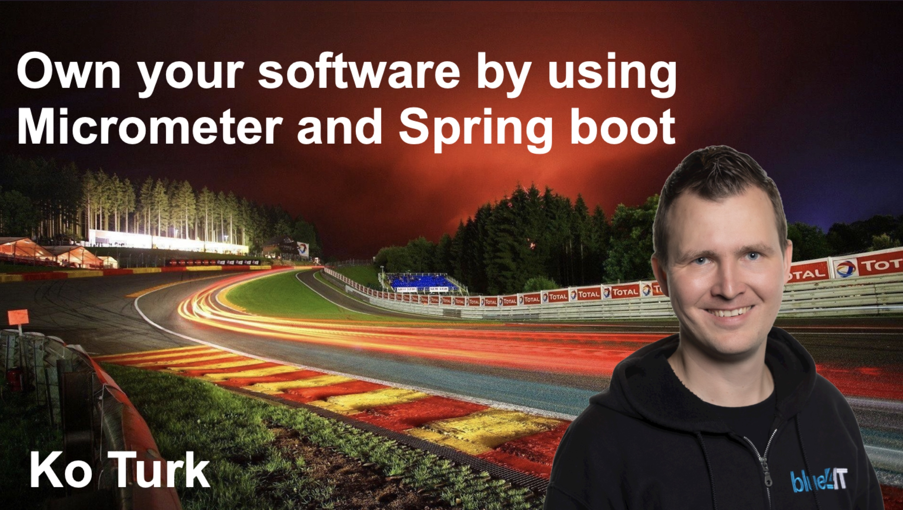

## From my talk  "Controlling your race with Micrometer and Spring Boot"

### Slides  

### Micrometer
In this repository you will find the Micrometer/SpringBoot project which I shared at Rabobank. 
For testing the Kafka instance, I also shared the docker-compose yaml file (see docker folder).

For building the project, go to CarRace and execute command:
<pre><code>mvn clean install</code></pre>

And run Spring Boot with:
<pre><code>mvn spring-boot:run</code></pre>

For running docker, go to that folder and execute command:
<pre><code>docker-compose up</code></pre>

### Prometheus
If you want to use Prometheus, please note that I downloaded and run Prometheus.
You can download it from: 
https://prometheus.io/download/   

Please use the configuration from prometheus/prometheus.yml

### Grafana
Please note that I downloaded and run Grafana as my preferred monitoring dashboard tool.   
You can download it from here: https://grafana.com/grafana/download   

You need to manually connect it to the prometheus database (through dashboard).
Btw. the default password will be admin/admin and you're required to change it after logging in.

